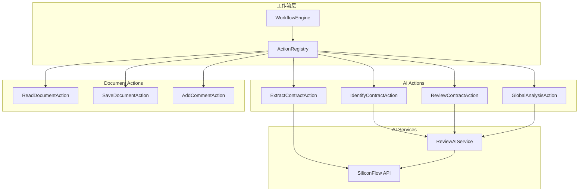

# Design Document

## Overview

本设计文档描述如何将现有的 AI 操作原子化为工作流 Actions，集成到现有的工作流引擎中。通过这种架构，可以实现：

1. **代码复用**：AI 操作可以在不同场景中复用
2. **灵活编排**：通过工作流组合不同的 AI 操作
3. **统一接口**：所有 AI 操作遵循相同的 Action 接口
4. **渐进式重构**：可以逐步将现有页面迁移到工作流模式

## Architecture



## Components and Interfaces

### 1. AI Action 基类扩展

扩展现有的 `BaseAction` 类，添加 AI 操作特有的功能：

```javascript
// AIBaseAction 继承自 BaseAction
class AIBaseAction extends BaseAction {
  constructor(options) {
    super(options)
    this.category = 'ai'  // 操作分类
  }
  
  // AI 操作通用的进度回调处理
  emitProgress(params, stage, content = '') {
    if (params.onProgress) {
      params.onProgress({ stage, content })
    }
  }
}
```

### 2. AI Actions 定义

#### 2.1 IdentifyContractAction（合同类型识别）

```javascript
{
  type: 'identifyContract',
  name: '识别合同类型',
  description: '使用 AI 识别合同的类型和子类型',
  icon: '🔍',
  category: 'ai',
  schema: {
    properties: {
      onProgress: { type: 'function', title: '进度回调' }
    },
    required: []
  }
}
```

**输入**：从 context.documentText 获取文档内容
**输出**：{ type, subtype, confidence }
**上下文更新**：context.data.contractType

#### 2.2 ExtractContractAction（合同要素提取）

```javascript
{
  type: 'extractContract',
  name: '提取合同要素',
  description: '使用 AI 提取合同中的关键信息',
  icon: '📋',
  category: 'ai',
  schema: {
    properties: {
      extractTags: { 
        type: 'array', 
        title: '提取标签',
        description: '要提取的信息标签列表'
      },
      onProgress: { type: 'function', title: '进度回调' }
    },
    required: []
  }
}
```

**输入**：context.documentText, params.extractTags
**输出**：{ elements: {...}, rawResponse }
**上下文更新**：context.data.extractedElements

#### 2.3 ReviewContractAction（合同审查）

```javascript
{
  type: 'reviewContract',
  name: '审查合同',
  description: '使用 AI 审查合同并识别法律风险',
  icon: '⚖️',
  category: 'ai',
  schema: {
    properties: {
      strategy: { 
        type: 'string', 
        title: '审查策略',
        enum: ['full', 'segment'],
        default: 'full'
      },
      useCustomRules: { type: 'boolean', title: '使用自定义规则' },
      autoApply: { type: 'boolean', title: '自动应用批注' },
      onProgress: { type: 'function', title: '进度回调' }
    },
    required: []
  }
}
```

**输入**：context.documentText, context.data.contractType, params
**输出**：{ issues, risks, checklist, summary }
**上下文更新**：context.data.reviewResult

#### 2.4 GlobalAnalysisAction（全局分析）

```javascript
{
  type: 'globalAnalysis',
  name: '全局分析',
  description: '分析合同整体结构和风险区域',
  icon: '🌐',
  category: 'ai',
  schema: {
    properties: {
      onProgress: { type: 'function', title: '进度回调' }
    },
    required: []
  }
}
```

**输入**：context.documentText
**输出**：{ type, subtype, structure, riskAreas }
**上下文更新**：context.data.globalAnalysis

### 3. 上下文数据结构扩展

```javascript
// 扩展 WorkflowContext 类型
{
  documentText: string,           // 文档内容
  documentInfo: {                 // 文档信息
    name: string,
    path: string
  },
  previousResult: StepResult,     // 上一步结果
  data: {
    // 新增 AI 相关数据
    contractType: {               // 合同类型
      type: string,
      subtype: string,
      confidence: string
    },
    extractedElements: {          // 提取的要素
      [key: string]: any
    },
    reviewResult: {               // 审查结果
      issues: Array,
      risks: Array,
      checklist: Array,
      summary: Object
    },
    globalAnalysis: {             // 全局分析
      type: string,
      subtype: string,
      structure: Array,
      riskAreas: Array
    }
  }
}
```

### 4. ActionTypes 扩展

```javascript
export const ActionTypes = {
  // 现有文档操作
  READ_DOCUMENT: 'readDocument',
  SAVE_DOCUMENT: 'saveDocument',
  ADD_HEADER: 'addHeader',
  ADD_COMMENT: 'addComment',
  ADD_REVISION: 'addRevision',
  RENAME_DOCUMENT: 'renameDocument',
  EXPORT_PDF: 'exportPDF',
  DELETE_FILE: 'deleteFile',
  
  // 新增 AI 操作
  IDENTIFY_CONTRACT: 'identifyContract',
  EXTRACT_CONTRACT: 'extractContract',
  REVIEW_CONTRACT: 'reviewContract',
  GLOBAL_ANALYSIS: 'globalAnalysis'
}
```

### 5. 预设工作流模板

```javascript
// presets.js 扩展
export const aiWorkflowPresets = {
  fullContractReview: {
    id: 'full-contract-review',
    name: '完整合同审查',
    description: '读取文档 → 识别类型 → 全局分析 → 详细审查 → 保存',
    steps: [
      { actionType: 'readDocument' },
      { actionType: 'identifyContract' },
      { actionType: 'globalAnalysis' },
      { actionType: 'reviewContract', params: { strategy: 'full', autoApply: true } },
      { actionType: 'saveDocument' }
    ]
  },
  
  contractExtraction: {
    id: 'contract-extraction',
    name: '合同要素提取',
    description: '读取文档 → 识别类型 → 提取要素',
    steps: [
      { actionType: 'readDocument' },
      { actionType: 'identifyContract' },
      { actionType: 'extractContract' }
    ]
  },
  
  quickRiskScan: {
    id: 'quick-risk-scan',
    name: '快速风险扫描',
    description: '读取文档 → 全局分析（识别高风险区域）',
    steps: [
      { actionType: 'readDocument' },
      { actionType: 'globalAnalysis' }
    ]
  }
}
```

## Data Models

### StepResult（步骤结果）

```typescript
interface StepResult {
  success: boolean
  message: string
  data?: {
    // AI 操作特有的数据字段
    contractType?: ContractType
    extractedElements?: Record<string, any>
    reviewResult?: ReviewResult
    globalAnalysis?: GlobalAnalysis
  }
}
```

### ContractType（合同类型）

```typescript
interface ContractType {
  type: string        // 主类型，如 "买卖合同"
  subtype: string     // 子类型，如 "商品买卖"
  confidence: 'high' | 'medium' | 'low'
}
```

### ReviewResult（审查结果）

```typescript
interface ReviewResult {
  issues: Array<{
    keyword: string       // 问题关键词
    searchKeyword: string // 用于定位的关键词
    comment: string       // 批注内容
    position: string      // 位置描述
    riskLevel: 'high' | 'medium' | 'low'
    checklistId?: string  // 关联的审查清单项
  }>
  risks: Array<{
    description: string
    level: string
    suggestion: string
  }>
  checklist: Array<ChecklistItem>
  summary: {
    totalIssues: number
    totalRisks: number
    checklistCount: number
  }
}
```

### ProgressInfo（进度信息）

```typescript
interface AIProgressInfo {
  stage: string           // 当前阶段描述
  content?: string        // 当前内容（流式响应时）
  current?: number        // 当前进度
  total?: number          // 总进度
}
```

## Correctness Properties

*A property is a characteristic or behavior that should hold true across all valid executions of a system-essentially, a formal statement about what the system should do. Properties serve as the bridge between human-readable specifications and machine-verifiable correctness guarantees.*

### Property 1: AI Actions Registration Completeness

*For any* initialized workflow engine, the action registry SHALL contain all defined AI action types (identifyContract, extractContract, reviewContract, globalAnalysis).

**Validates: Requirements 1.1, 1.2**

### Property 2: Action Schema Completeness

*For any* registered AI action, calling getInfo() SHALL return an object containing type, name, description, icon, and schema properties, all of which are non-null.

**Validates: Requirements 1.2**

### Property 3: Contract Type Context Storage

*For any* successful execution of identifyContract action with non-empty document text, the workflow context.data.contractType SHALL contain type, subtype, and confidence fields.

**Validates: Requirements 2.2, 2.4**

### Property 4: Extraction Result Structure

*For any* successful execution of extractContract action, the result.data SHALL contain an elements object, and context.data.extractedElements SHALL be updated with the same data.

**Validates: Requirements 3.2, 3.3**

### Property 5: Custom Extract Tags Usage

*For any* extractContract action execution with params.extractTags provided, the AI service SHALL be called with those specific tags instead of default tags.

**Validates: Requirements 3.4**

### Property 6: Review Result Structure

*For any* successful execution of reviewContract action, the result.data.issues array SHALL contain objects with keyword, comment, position, and riskLevel fields.

**Validates: Requirements 4.2, 4.3**

### Property 7: Context Contract Type Usage

*For any* reviewContract action execution where context.data.contractType exists, the AI service SHALL receive the contract type for more accurate review.

**Validates: Requirements 4.4**

### Property 8: Progress Event Lifecycle

*For any* AI action execution with onProgress callback provided, the callback SHALL be invoked at least twice: once at start (with stage information) and once at completion (with final status).

**Validates: Requirements 6.1, 6.2, 6.3, 6.4**

### Property 9: Context Data Propagation

*For any* workflow with multiple AI actions, data stored in context.data by step N SHALL be accessible to step N+1 and all subsequent steps.

**Validates: Requirements 7.1, 7.2, 7.3**

### Property 10: Preset Workflow Structure

*For any* preset workflow returned by the system, it SHALL contain id, name, description, and a non-empty steps array where each step has actionType.

**Validates: Requirements 8.3, 8.4**

## Error Handling

### AI Service Errors

1. **网络错误**：返回 `createErrorResult('网络连接失败，请检查网络')`
2. **API 密钥错误**：返回 `createErrorResult('API 密钥无效，请在设置中配置')`
3. **超时错误**：返回 `createErrorResult('请求超时，文档可能过长')`
4. **解析错误**：返回 `createErrorResult('AI 响应解析失败')` 并附带原始响应

### Context Errors

1. **文档内容为空**：返回 `createErrorResult('请先读取文档内容')`
2. **缺少必要上下文**：返回 `createErrorResult('缺少必要的上下文数据')`

### Graceful Degradation

1. **全局分析失败**：降级为基本的合同类型识别
2. **审查部分失败**：返回已完成的部分结果，标记失败的段落

## Testing Strategy

### 单元测试

1. **Action 注册测试**：验证所有 AI actions 正确注册
2. **Schema 验证测试**：验证参数 schema 定义正确
3. **结果结构测试**：验证返回结果符合预期结构

### 属性测试

使用 fast-check 库进行属性测试：

1. **注册完整性测试**：生成随机 action 类型列表，验证注册后都能获取
2. **上下文传递测试**：生成随机上下文数据，验证步骤间正确传递
3. **进度回调测试**：生成随机执行场景，验证回调正确触发

### 集成测试

1. **工作流执行测试**：测试完整工作流的执行
2. **预设工作流测试**：测试预设模板的加载和执行

### 测试框架

- **单元测试**：Vitest
- **属性测试**：fast-check
- **Mock**：使用 vi.mock 模拟 AI 服务

