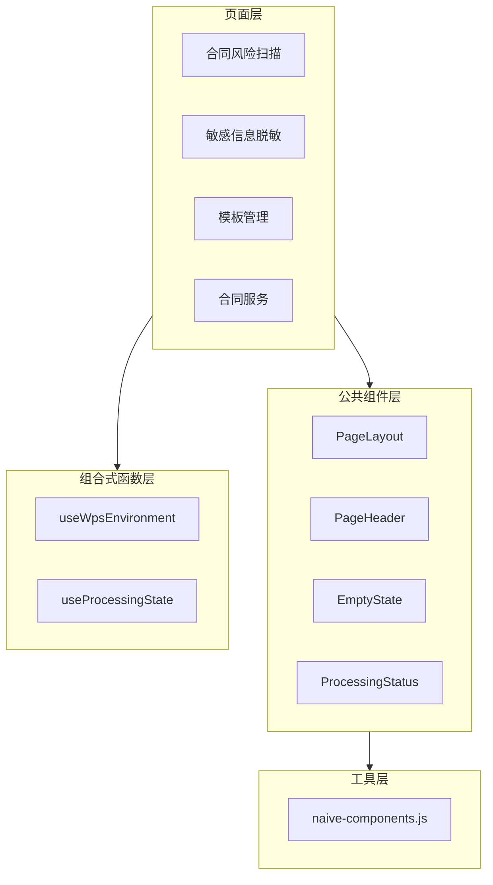

# Design Document

## Overview

本设计文档描述 WPS 律师工具箱项目的代码重构与优化方案。通过提取公共组件、封装 composables、统一组件导入等方式，减少代码重复，提升可维护性。

## Architecture



## Components and Interfaces

### 1. useWpsEnvironment Composable

```javascript
// src/composables/useWpsEnvironment.js
export function useWpsEnvironment() {
  // 返回值
  return {
    isAvailable,      // ref<boolean> - WPS 环境是否可用
    application,      // ref<Application|null> - WPS Application 对象
    activeDocument,   // ref<Document|null> - 当前活动文档
    error,            // ref<string|null> - 错误信息
    checkEnvironment, // () => boolean - 检查环境并显示提示
    getDocument,      // () => Document|null - 获取文档（带错误提示）
    getFullText,      // () => string|null - 获取文档全文
  }
}
```

### 2. PageHeader Component

```vue
<!-- src/components/common/PageHeader.vue -->
<template>
  <div class="wps-card wps-section">
    <div class="flex items-center justify-between mb-4">
      <div class="flex items-center gap-2">
        <span v-if="icon" class="text-lg">{{ icon }}</span>
        <span class="text-lg font-semibold">{{ title }}</span>
        <n-tag v-if="loading" type="warning" size="small">{{ loadingText }}</n-tag>
        <slot name="tag" />
      </div>
      <slot name="actions" />
    </div>
    <slot name="description" />
  </div>
</template>

Props:
- title: string (required)
- icon: string
- loading: boolean
- loadingText: string (default: '处理中')

Slots:
- tag: 自定义标签
- actions: 操作按钮区域
- description: 功能说明区域
```

### 3. EmptyState Component

```vue
<!-- src/components/common/EmptyState.vue -->
<template>
  <div class="wps-card wps-section">
    <n-empty :description="description" class="py-8">
      <template #icon>
        <span class="text-4xl">{{ icon }}</span>
      </template>
      <template v-if="$slots.action" #extra>
        <slot name="action" />
      </template>
    </n-empty>
  </div>
</template>

Props:
- description: string (default: '暂无数据')
- icon: string (default: '📭')
```

### 4. ProcessingStatus Component

```vue
<!-- src/components/common/ProcessingStatus.vue -->
<template>
  <div class="wps-card wps-section">
    <n-space vertical>
      <div class="flex items-center gap-2">
        <n-spin size="small" />
        <span class="text-sm font-semibold">{{ stage }}</span>
      </div>
      <n-progress v-if="showProgress" :percentage="percentage" type="line" status="info" />
      <div v-if="showProgress" class="text-xs text-gray-500">
        进度: {{ current }} / {{ total }}
      </div>
    </n-space>
  </div>
</template>

Props:
- stage: string (default: '正在处理...')
- current: number (default: 0)
- total: number (default: 0)
- showProgress: boolean (computed from current > 0)
```

### 5. PageLayout Component

```vue
<!-- src/components/common/PageLayout.vue -->
<template>
  <n-config-provider>
    <div class="p-2.5 h-screen overflow-y-auto scrollbar-none">
      <slot />
    </div>
  </n-config-provider>
</template>
```

### 6. NaiveUI 组件统一导出

```javascript
// src/components/naive-components.js
// 布局组件
export { NCard, NSpace, NGrid, NGridItem, NDivider } from 'naive-ui'

// 表单组件
export { NForm, NFormItem, NInput, NInputNumber, NSelect, NSwitch, NCheckbox, NRadio, NRadioGroup } from 'naive-ui'

// 反馈组件
export { NButton, NTag, NAlert, NEmpty, NSpin, NProgress, NModal, NPopconfirm } from 'naive-ui'

// 数据展示组件
export { NList, NListItem, NThing, NStatistic, NCollapse, NCollapseItem, NTabs, NTabPane } from 'naive-ui'

// 配置组件
export { NConfigProvider, NMessageProvider } from 'naive-ui'
```

## Data Models

### ProcessingState

```typescript
interface ProcessingState {
  isProcessing: boolean
  stage: string
  current: number
  total: number
  error: string | null
}
```

### WpsEnvironmentState

```typescript
interface WpsEnvironmentState {
  isAvailable: boolean
  application: Application | null
  activeDocument: Document | null
  error: string | null
}
```

## Correctness Properties

*A property is a characteristic or behavior that should hold true across all valid executions of a system-essentially, a formal statement about what the system should do. Properties serve as the bridge between human-readable specifications and machine-verifiable correctness guarantees.*

### Property 1: WPS 环境检查一致性
*For any* WPS 环境状态（可用/不可用），useWpsEnvironment 返回的 isAvailable 值应与 window.Application 的存在性一致
**Validates: Requirements 1.1, 1.2**

### Property 2: 文档对象正确性
*For any* 文档状态（打开/未打开），useWpsEnvironment 返回的 activeDocument 应与 window.Application.ActiveDocument 一致
**Validates: Requirements 1.3, 1.4**

### Property 3: PageHeader 属性渲染
*For any* title 和 icon 属性组合，PageHeader 组件应正确渲染对应的标题和图标元素
**Validates: Requirements 2.1**

### Property 4: PageHeader 加载状态
*For any* loading 属性值（true/false），PageHeader 组件应正确显示或隐藏状态标签
**Validates: Requirements 2.4**

### Property 5: EmptyState 图标渲染
*For any* icon 属性值，EmptyState 组件应正确渲染对应的图标
**Validates: Requirements 3.2**

### Property 6: EmptyState 描述渲染
*For any* description 属性值，EmptyState 组件应正确渲染对应的描述文本
**Validates: Requirements 3.3**

### Property 7: ProcessingStatus 进度显示
*For any* current 和 total 值组合（current <= total），ProcessingStatus 组件应正确计算并显示进度百分比
**Validates: Requirements 4.1, 4.2**

### Property 8: ProcessingStatus 错误显示
*For any* 错误信息字符串，ProcessingStatus 组件应正确显示错误状态
**Validates: Requirements 4.4**

### Property 9: NaiveUI 组件导出有效性
*For any* 从统一导出文件导入的组件，该组件应是有效的 Vue 组件对象
**Validates: Requirements 5.1**

## Error Handling

1. **WPS 环境不可用**: 显示友好提示 "请在 WPS 环境中使用此功能"
2. **文档未打开**: 显示提示 "未找到活动文档"
3. **组件渲染错误**: 使用 Vue 的 errorCaptured 钩子捕获并记录错误

## Testing Strategy

### 单元测试
- 使用 Vitest 进行单元测试
- 测试 composables 的返回值和行为
- 测试组件的 props 渲染

### 属性测试
- 使用 fast-check 进行属性测试
- 测试 composables 在各种输入下的行为一致性
- 测试组件在各种 props 组合下的渲染正确性

### 测试框架配置
```javascript
// vitest.config.js
import { defineConfig } from 'vitest/config'
import vue from '@vitejs/plugin-vue'

export default defineConfig({
  plugins: [vue()],
  test: {
    environment: 'jsdom',
    globals: true
  }
})
```
