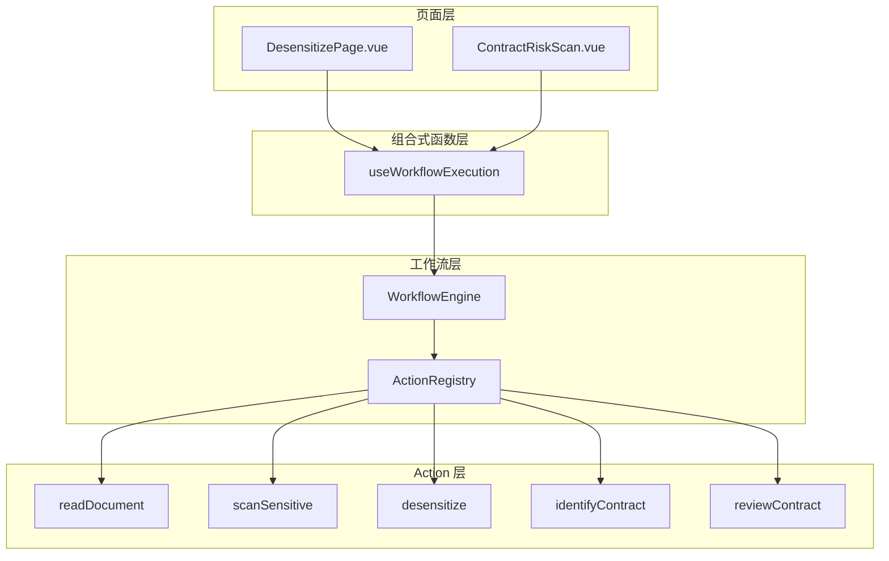

# Design Document: 工作流页面重构

## Overview

本设计文档描述如何使用现有的工作流引擎重构「信息脱敏页面」和「合同风险扫描页面」。重构的核心思路是将页面中直接调用业务服务的代码替换为调用工作流引擎，复用已有的 Action 实现，统一操作流程和进度反馈机制。

### 设计目标

1. **代码简化**: 页面组件只负责 UI 展示和用户交互，业务逻辑由工作流 Action 处理
2. **一致性**: 两个页面使用相同的工作流执行模式和进度反馈机制
3. **可维护性**: 业务逻辑集中在 Action 中，便于测试和维护
4. **功能完整**: 保留所有现有功能，不丢失任何能力

## Architecture



## Components and Interfaces

### 1. useWorkflowExecution Composable

新增一个组合式函数，封装工作流执行的通用逻辑：

```javascript
// src/composables/useWorkflowExecution.js
export function useWorkflowExecution() {
  const isExecuting = ref(false)
  const progress = ref({ current: 0, total: 0, stage: '', stepName: '' })
  const result = ref(null)
  const error = ref(null)

  async function execute(workflow, options = {}) {
    // 执行工作流并管理状态
  }

  function reset() {
    // 重置状态
  }

  return {
    isExecuting,
    progress,
    result,
    error,
    execute,
    reset
  }
}
```

### 2. 脱敏页面调用预设工作流

直接使用 `presets.js` 中已定义的预设工作流：

```javascript
import { workflowEngine, getPresetById, createWorkflowFromPreset } from '@/services/workflow'

// 扫描敏感信息 - 使用预设 'scan-sensitive'
const scanWorkflow = createWorkflowFromPreset('scan-sensitive', {
  stepParams: {
    SCAN_SENSITIVE: { whitelist, blacklist, scanTypes }
  }
})
await workflowEngine.execute(scanWorkflow, { onProgress })

// 执行脱敏 - 使用预设 'desensitize-document'
const desensitizeWorkflow = createWorkflowFromPreset('desensitize-document', {
  stepParams: {
    DESENSITIZE: { autoApply: true }
  }
})
await workflowEngine.execute(desensitizeWorkflow, { onProgress })
```

### 3. 风险扫描页面调用预设工作流

复用合同审查相关预设，或新增一个风险扫描专用预设：

```javascript
// 方案1: 使用现有的中立视角审查预设
const workflow = createWorkflowFromPreset('party-a-review', {
  stepParams: {
    REVIEW_CONTRACT: { 
      perspective: 'neutral',
      depth: scanStrategy === 'full' ? 'standard' : 'deep',
      autoApply: false  // 风险扫描不自动应用批注
    }
  }
})

// 方案2: 新增风险扫描专用预设 'contract-risk-scan'
const workflow = getPresetById('contract-risk-scan')
await workflowEngine.execute(workflow, { onProgress })
```

## Data Models

### 工作流执行状态

```typescript
interface WorkflowExecutionState {
  isExecuting: boolean        // 是否正在执行
  progress: {
    current: number           // 当前步骤索引
    total: number             // 总步骤数
    stage: string             // 当前阶段描述
    stepName: string          // 当前步骤名称
  }
  result: WorkflowResult | null  // 执行结果
  error: string | null           // 错误信息
}
```

### 脱敏页面状态

```typescript
interface DesensitizePageState {
  sensitiveInfoList: SensitiveInfo[]  // 敏感信息列表
  whitelist: string                    // 白名单配置
  customSensitiveWords: string         // 自定义敏感词
  scanned: boolean                     // 是否已扫描
}
```

### 风险扫描页面状态

```typescript
interface RiskScanPageState {
  scanStrategy: 'full' | 'segment'     // 扫描策略
  contractType: string                  // 合同类型
  scanResult: ReviewResult | null       // 扫描结果
  scanned: boolean                      // 是否已扫描
}
```

## Correctness Properties

*A property is a characteristic or behavior that should hold true across all valid executions of a system-essentially, a formal statement about what the system should do. Properties serve as the bridge between human-readable specifications and machine-verifiable correctness guarantees.*

### Property 1: 工作流执行触发正确性

*For any* 页面操作（扫描、脱敏、审查），当用户触发该操作时，工作流引擎应被调用且工作流定义应包含正确的 Action 类型序列。

**Validates: Requirements 1.1, 1.3, 2.1, 4.3**

### Property 2: 结果数据映射正确性

*For any* 工作流执行结果，页面状态应正确反映工作流上下文中的数据，包括敏感信息列表、审查结果等。

**Validates: Requirements 1.2, 1.4, 2.3**

### Property 3: 参数传递正确性

*For any* 用户配置（白名单、扫描策略、自定义敏感词等），这些配置应被正确传递到工作流 Action 的参数中。

**Validates: Requirements 2.4, 3.1, 3.2, 3.3**

### Property 4: 进度回调处理正确性

*For any* 工作流执行过程，进度回调应被正确触发，且页面进度状态应反映当前步骤信息（步骤名称、当前索引、总数）。

**Validates: Requirements 2.2, 5.1, 5.2**

### Property 5: 错误处理正确性

*For any* 工作流执行失败场景，页面应正确显示错误信息，且允许用户重试操作。

**Validates: Requirements 5.3**

### Property 6: 结果格式一致性

*For any* 工作流执行结果，重构后页面展示的结果格式应与原有实现保持一致。

**Validates: Requirements 6.3**

## Error Handling

### 工作流执行错误

```javascript
try {
  const result = await workflowEngine.execute(workflow, { onProgress })
  if (!result.success) {
    error.value = result.message
    window.$message?.error(result.message)
  }
} catch (e) {
  error.value = e.message || '执行失败'
  window.$message?.error(error.value)
}
```

### 错误恢复策略

1. **步骤失败**: 显示失败步骤名称和错误信息，允许用户重试
2. **文档不可用**: 提示用户在 WPS 环境中打开文档
3. **网络错误**: 对于 AI 相关操作，提示网络问题并允许重试

## Testing Strategy

### 单元测试

1. **useWorkflowExecution composable 测试**
   - 测试状态初始化
   - 测试执行流程中状态变化
   - 测试错误处理

2. **工作流构建函数测试**
   - 测试参数正确传递到工作流定义
   - 测试不同配置生成正确的工作流结构

### 属性测试

使用 fast-check 进行属性测试：

1. **Property 1 测试**: 生成随机操作类型，验证工作流包含正确的 Action
2. **Property 3 测试**: 生成随机配置参数，验证参数被正确传递
3. **Property 4 测试**: 模拟工作流执行，验证进度回调被正确处理
4. **Property 5 测试**: 模拟失败场景，验证错误状态被正确设置

### 测试框架

- **单元测试**: Vitest
- **属性测试**: fast-check
- **组件测试**: @vue/test-utils（可选）
