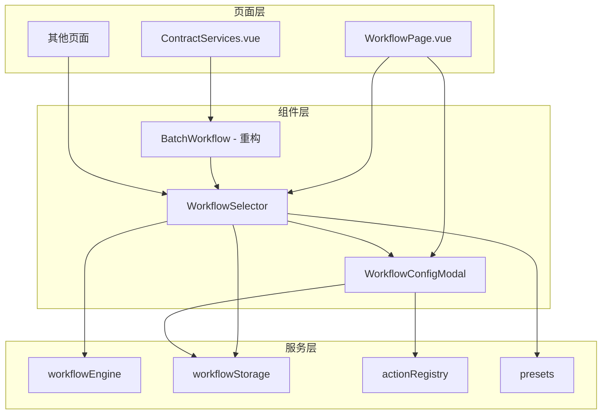

# Design Document: 工作流选择器组件

## Overview

本设计旨在创建一套可复用的工作流选择和配置组件，解决当前合同审查页面工作流硬编码的问题。通过将 WorkflowPage 的配置能力抽取为独立组件，实现工作流配置的统一化和复用。

核心组件：
1. **WorkflowSelector** - 工作流选择器，支持选择、预览、执行工作流
2. **WorkflowConfigModal** - 工作流配置弹窗，支持新建、编辑工作流

## Architecture



## Components and Interfaces

### 1. WorkflowSelector 组件

可复用的工作流选择器，支持嵌入任意页面。

```typescript
// Props 定义
interface WorkflowSelectorProps {
  // 工作流分类过滤，可选值: 'ai' | 'document' | null (显示全部)
  category?: 'ai' | 'document' | null
  // 紧凑模式，适合嵌入折叠面板
  compact?: boolean
  // 是否显示新建按钮
  showCreate?: boolean
  // 是否显示用户工作流
  showUserWorkflows?: boolean
  // 默认选中的工作流 ID
  defaultSelected?: string
}

// Emits 定义
interface WorkflowSelectorEmits {
  // 工作流执行完成
  (e: 'complete', result: WorkflowResult): void
  // 选中工作流变化
  (e: 'select', workflow: Workflow | null): void
}

// Expose 定义
interface WorkflowSelectorExpose {
  // 触发执行
  triggerExecute: () => Promise<void>
  // 是否正在执行
  isProcessing: ComputedRef<boolean>
  // 按钮文本
  buttonText: ComputedRef<string>
  // 是否可执行
  canExecute: ComputedRef<boolean>
  // 选中的工作流
  selectedWorkflow: ComputedRef<Workflow | null>
}
```

### 2. WorkflowConfigModal 组件

工作流配置弹窗，提供完整的工作流编辑能力。

```typescript
// Props 定义
interface WorkflowConfigModalProps {
  // 控制弹窗显示
  show: boolean
  // 编辑模式：传入工作流则为编辑，否则为新建
  workflow?: Workflow | null
  // 标题
  title?: string
}

// Emits 定义
interface WorkflowConfigModalEmits {
  // 更新显示状态
  (e: 'update:show', value: boolean): void
  // 保存工作流
  (e: 'save', workflow: Workflow): void
  // 执行工作流（不保存）
  (e: 'execute', workflow: Workflow): void
  // 取消
  (e: 'cancel'): void
}
```

### 3. 重构后的 BatchWorkflow 组件

简化为使用 WorkflowSelector 的包装组件。

```typescript
// 重构后的 BatchWorkflow 只需要：
// 1. 引入 WorkflowSelector
// 2. 传入 compact 模式
// 3. 处理执行完成回调
```

## Data Models

### Workflow 数据结构

```typescript
interface Workflow {
  id: string                    // 唯一标识
  name: string                  // 工作流名称
  description?: string          // 描述
  category: 'ai' | 'document'   // 分类
  steps: WorkflowStep[]         // 步骤列表
  createdAt?: number            // 创建时间（用户工作流）
  updatedAt?: number            // 更新时间（用户工作流）
}

interface WorkflowStep {
  actionType: string            // 操作类型
  name: string                  // 步骤名称
  params?: Record<string, any>  // 步骤参数
}

interface WorkflowResult {
  success: boolean              // 是否成功
  message?: string              // 结果消息
  steps: StepResult[]           // 各步骤结果
}

interface StepResult {
  step: WorkflowStep            // 步骤定义
  result: {
    success: boolean
    message?: string
    data?: any
  }
}
```

## Correctness Properties

*A property is a characteristic or behavior that should hold true across all valid executions of a system-essentially, a formal statement about what the system should do. Properties serve as the bridge between human-readable specifications and machine-verifiable correctness guarantees.*

### Property 1: 工作流列表完整性

*For any* 预设工作流列表和用户工作流列表，WorkflowSelector 显示的工作流数量应等于两者之和（在无分类过滤时）。

**Validates: Requirements 1.1, 5.1**

### Property 2: 分类过滤正确性

*For any* 工作流列表和分类过滤条件，过滤后的列表中所有工作流的 category 属性应与过滤条件一致。

**Validates: Requirements 4.2**

### Property 3: 步骤添加一致性

*For any* 操作类型，添加到工作流后，步骤列表长度应增加 1，且新步骤的 actionType 应与添加的操作类型一致。

**Validates: Requirements 2.2, 5.2**

### Property 4: 工作流保存持久化

*For any* 有效的工作流配置，保存后从 workflowStorage 读取应返回等价的工作流定义。

**Validates: Requirements 2.3, 3.2**

### Property 5: 工作流删除一致性

*For any* 已保存的工作流，删除后从 workflowStorage 查询该 ID 应返回 null。

**Validates: Requirements 3.3**

### Property 6: 执行回调正确性

*For any* 工作流执行，完成后 onComplete 回调应被调用，且传递的结果包含正确的 success 状态和 steps 数组。

**Validates: Requirements 1.3, 1.4, 4.3**

### Property 7: 编辑模式数据加载

*For any* 已保存的工作流，在编辑模式打开时，弹窗中的步骤列表应与原工作流的 steps 数组等价。

**Validates: Requirements 3.1, 5.3**

## Error Handling

1. **工作流执行失败**
   - 捕获每个步骤的执行错误
   - 记录失败步骤信息到结果中
   - 显示友好的错误提示

2. **存储操作失败**
   - 保存/删除失败时显示错误提示
   - 不影响当前工作流的执行状态

3. **无效工作流配置**
   - 验证工作流名称非空
   - 验证至少有一个步骤
   - 阻止无效配置的保存

## Testing Strategy

### 单元测试

使用 Vitest 进行单元测试：

1. **workflowStorage 测试**
   - 测试 save/get/delete/getAll 方法
   - 测试 ID 生成唯一性

2. **工作流过滤逻辑测试**
   - 测试分类过滤
   - 测试空列表处理

### 属性测试

使用 fast-check 进行属性测试：

1. **Property 1-2**: 生成随机工作流列表，验证显示和过滤逻辑
2. **Property 3**: 生成随机操作类型，验证添加步骤逻辑
3. **Property 4-5**: 生成随机工作流，验证存储的保存和删除
4. **Property 6**: Mock workflowEngine，验证回调机制
5. **Property 7**: 生成随机工作流，验证编辑模式加载

每个属性测试配置运行 100 次迭代。

测试文件命名：`test/workflow-selector.test.js`

测试标注格式：`**Feature: workflow-selector-component, Property {number}: {property_text}**`
