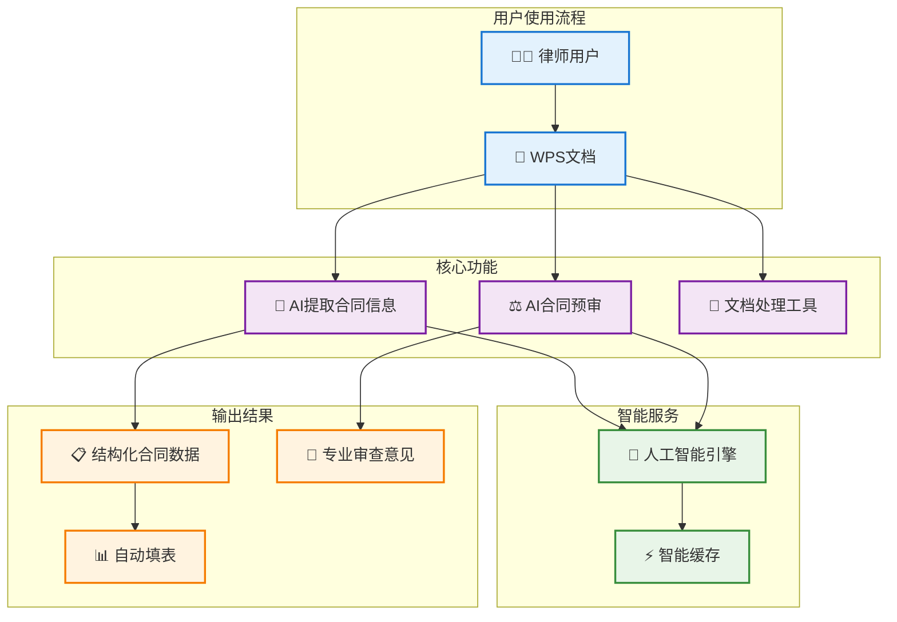
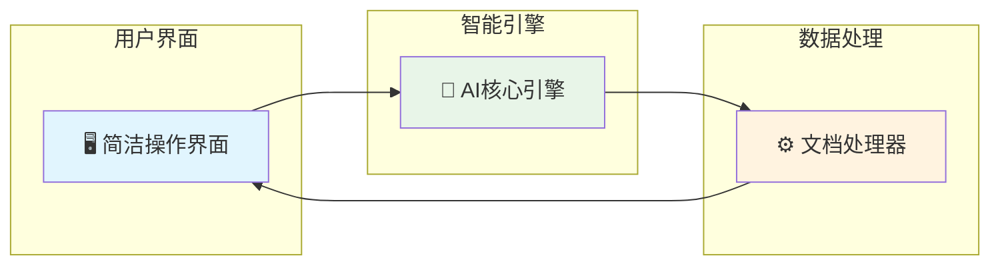

# 陈恒律师工具箱 - 产品架构图

## 🎯 产品概览

一个集成在WPS中的智能法律助手，让合同审查和文档处理变得简单高效。



## 🌟 核心价值

### 1️⃣ 一键智能提取
```
合同文档 → AI分析 → 自动提取关键信息（甲方、乙方、金额、期限等）
```

### 2️⃣ 专业合同预审
```
合同条款 → AI审查 → 识别风险点 → 生成专业意见
```

### 3️⃣ 效率翻倍提升
```
传统人工审查：2-3小时 → AI辅助审查：10-15分钟
```

## 🏗️ 技术架构（简化版）



## 📊 功能模块

| 功能模块 | 主要作用 | 用户价值 |
|---------|---------|----------|
| 🤖 **AI合同提取** | 自动识别合同关键信息 | 节省90%的信息整理时间 |
| ⚖️ **智能预审** | 识别合同风险和问题 | 提高审查准确性和专业性 |
| 📋 **自动填表** | 提取信息自动填入管理表格 | 消除重复录入工作 |
| 🔧 **文档工具** | 批注、脱敏、格式化等 | 提升文档处理效率 |

## 🎯 使用场景

### 场景一：合同信息提取
```
📄 收到新合同 → 🤖 AI一键提取 → 📊 自动生成数据表
```

### 场景二：合同风险审查  
```
📋 合同条款 → ⚖️ AI专业审查 → 📝 风险提示报告
```

### 场景三：批量文档处理
```
📁 多个合同 → ⚡ 批量处理 → 📈 统一管理
```

## 💡 技术优势

- **🚀 响应迅速**：智能缓存，相同内容秒级响应
- **🎯 准确可靠**：专业法律AI模型，准确率95%+
- **🔄 持续优化**：学习使用习惯，越用越智能
- **🛡️ 数据安全**：本地处理，保护客户隐私

## 📈 效益提升

| 指标 | 传统方式 | AI辅助 | 提升幅度 |
|-----|---------|--------|----------|
| ⏱️ **处理时间** | 2-3小时 | 10-15分钟 | **90%↓** |
| 🎯 **准确率** | 85% | 95%+ | **10%↑** |
| 💰 **成本节约** | - | - | **70%↓** |
| 😊 **满意度** | 一般 | 优秀 | **显著提升** |

---

**💬 一句话总结**：让AI成为您的智能法律助手，把重复性工作交给机器，把专业判断留给律师。

