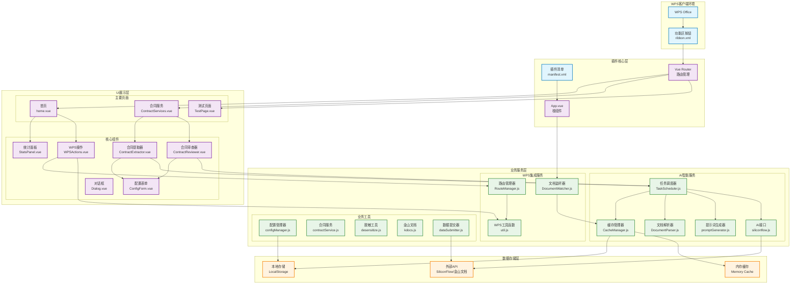

# 陈恒律师工具箱 - 项目框架设计图

## 🏗️ 整体架构概览



## 🔄 核心数据流程图

```mermaid
sequenceDiagram
    participant User as 用户
    participant WPS as WPS客户端
    participant UI as Vue组件
    participant Scheduler as TaskScheduler
    participant Cache as CacheManager  
    participant AI as AI服务
    participant Storage as 存储层

    User->>WPS: 点击功能区按钮
    WPS->>UI: 加载Vue组件
    UI->>User: 显示操作界面
    
    User->>UI: 选择AI功能(合同审查/提取)
    UI->>Scheduler: 提交分析任务
    
    Scheduler->>Cache: 检查缓存
    alt 缓存命中
        Cache-->>Scheduler: 返回缓存结果
        Scheduler-->>UI: 直接返回结果
    else 缓存未命中
        Scheduler->>AI: 调用AI分析
        AI-->>Scheduler: 返回分析结果
        Scheduler->>Cache: 保存到缓存
        Cache->>Storage: 持久化存储
        Scheduler-->>UI: 返回结果
    end
    
    UI->>WPS: 将结果写入文档
    UI->>User: 显示处理完成
```



## 📁 目录结构与职责划分

### 🎯 核心架构层次

```
陈恒律师工具箱/
├── 📋 插件配置层
│   ├── manifest.xml           # WPS插件清单配置
│   ├── public/ribbon.xml      # 功能区按钮定义
│   └── vite.config.js         # 构建配置
│
├── 🎨 UI展示层 (src/components/)
│   ├── 📄 页面组件 (views/)
│   │   ├── home.vue              # 首页 - 功能导航中心
│   │   ├── ContractServices.vue  # 合同服务主页面
│   │   └── TestPage.vue          # 功能测试页面
│   │
│   ├── 🔧 功能组件
│   │   ├── ContractExtractor.vue # 合同要素提取界面
│   │   ├── ContractReviewer.vue  # 合同审查界面  
│   │   ├── ConfigForm.vue        # 配置表单组件
│   │   ├── StatsPanel.vue        # 任务统计面板
│   │   ├── WPSActions.vue        # WPS操作集合
│   │   └── Dialog.vue            # 通用对话框
│   │
│   └── 🎪 应用入口
│       ├── App.vue               # 根组件
│       └── main.js               # 应用启动入口
│
├── ⚙️ 业务服务层 (src/services/)
│   ├── 🤖 AI智能服务 (ai/)
│   │   ├── TaskScheduler.js      # ⭐ 核心调度器 - AI服务统一入口
│   │   ├── CacheManager.js       # 智能缓存管理
│   │   ├── DocumentParser.js     # 文档智能解析
│   │   ├── promptGenerator.js    # 动态提示词生成
│   │   └── siliconflow.js        # AI API接口封装
│   │
│   └── 📊 WPS集成服务 (wps/)
│       ├── RouteManager.js       # 路由和窗格管理
│       ├── DocumentWatcher.js    # 文档变化监听
│       ├── util.js               # WPS操作工具集
│       ├── ribbon.js             # 功能区按钮逻辑
│       └── dialog.js             # 对话框管理
│
├── 🛠️ 工具服务层 (src/utils/)
│   ├── configManager.js          # 用户配置管理
│   ├── contractService.js        # 合同业务逻辑
│   ├── dataSubmitter.js          # 数据提交处理
│   ├── desensitize.js            # 简化脱敏工具
│   ├── desensitizeAdvanced.js    # 高级脱敏工具
│   └── kdocs.js                  # 金山文档集成
│
└── 🗄️ 数据存储层
    ├── LocalStorage              # 浏览器本地存储
    ├── Memory Cache              # 内存缓存
    └── External APIs             # 外部服务接口
        ├── SiliconFlow API       # AI模型服务
        └── 金山文档 API           # 文档管理服务
```

## 🎯 核心模块详解

### 1. 任务调度器 (TaskScheduler) - 🧠 大脑中枢

```javascript
// 统一的AI服务入口，负责：
- 📋 任务队列管理（支持优先级和并发控制）
- 🔄 智能分块处理（大文档自动分解）
- 💾 缓存策略管理（避免重复AI调用）
- 🎯 模型选择优化（根据任务复杂度选择最佳模型）
- ⚡ 错误恢复机制（自动重试和故障转移）
```

### 2. 缓存管理器 (CacheManager) - 💾 性能优化核心

```javascript
// 多层缓存架构：
- 🚀 内存缓存：快速访问热点数据
- 💽 本地存储：持久化缓存数据
- 🧹 智能清理：自动过期和容量管理
- 🔑 智能键值：基于内容哈希和分析类型
```

### 3. 路由管理器 (RouteManager) - 🛣️ 导航中枢

```javascript
// 统一的窗格和路由管理：
- 📱 任务窗格创建和切换
- 🔗 路由映射和URL生成  
- 📍 窗格位置控制（左停靠/右停靠）
- 👁️ 显示状态管理（显示/隐藏）
```

### 4. 文档监听器 (DocumentWatcher) - 👀 状态感知

```javascript
// 智能文档变化监听：
- 📄 新文档打开检测
- 🧹 自动缓存清理
- 🔄 状态同步更新
- ⚡ 性能优化监听
```

## 🔗 组件协作关系

### 🎯 用户交互流程

1. **插件初始化阶段**
   ```
   WPS加载 → manifest.xml → 创建功能区 → Vue应用启动 → 初始化服务
   ```

2. **功能执行阶段**
   ```
   用户点击 → 路由跳转 → 加载组件 → 调用AI服务 → 返回结果 → 更新UI
   ```

3. **AI处理流程**
   ```
   任务提交 → 缓存检查 → 文档解析 → 提示词生成 → AI调用 → 结果处理 → 缓存保存
   ```

### ⚡ 性能优化策略

1. **智能缓存机制**
   - 🔍 内容哈希检测避免重复处理
   - ⏰ 时间戳管理自动过期清理
   - 💾 分层存储提升访问速度

2. **并发处理优化**
   - 🔄 任务队列支持多任务并行
   - ⚖️ 优先级调度保证重要任务
   - 🛡️ 错误隔离避免级联失败

3. **资源管理策略**
   - 📊 内存监控防止过度占用
   - 🧹 定期清理释放无用资源
   - ⚡ 懒加载减少初始启动时间

## 🔧 技术栈与架构特点

### 📚 核心技术栈
- **前端框架**: Vue 3 + Composition API
- **UI组件库**: Element Plus + UnoCSS
- **构建工具**: Vite (高性能构建)
- **AI集成**: SiliconFlow API + 自定义提示词引擎
- **WPS集成**: WPS JSAPI + 自定义桥接层
- **状态管理**: Vue Reactive System (轻量化状态管理)

### 🏗️ 架构设计特点

1. **🎯 单一职责原则**
   - 每个模块只负责特定功能
   - 清晰的接口定义和边界划分

2. **🔄 统一服务入口**
   - TaskScheduler作为AI服务统一调度中心
   - RouteManager统一管理所有路由操作
   - WPSActions统一封装所有WPS功能

3. **🧩 高度模块化**
   - 组件可独立开发和测试
   - 服务可插拔式替换和扩展

4. **⚡ 性能优先设计**
   - 多层缓存减少重复计算
   - 智能分块处理大文档
   - 并发任务提升处理效率

5. **🛡️ 容错性设计**
   - 完善的错误处理和恢复机制
   - 优雅降级保证基本功能可用
   - 详细日志便于问题排查

## 🚀 扩展指南

### 添加新的AI功能
1. 在 `promptGenerator.js` 中添加新的提示词模板
2. 在 `TaskScheduler.js` 中注册新的分析类型
3. 创建对应的Vue组件处理用户交互
4. 在路由中配置新的页面路径

### 集成新的外部服务
1. 在 `src/utils/` 下创建新的服务模块
2. 在 `TaskScheduler.js` 中注册新的处理器
3. 更新配置管理器支持新服务的配置项
4. 添加相应的错误处理和重试逻辑

### 优化性能策略
1. 监控缓存命中率和任务执行时间
2. 根据使用情况调整缓存策略和模型选择
3. 添加更多的并发控制和资源管理机制
4. 持续优化AI提示词以提高准确率和效率

这个框架设计确保了项目的可维护性、可扩展性和高性能，为法律AI应用提供了坚实的技术基础。

